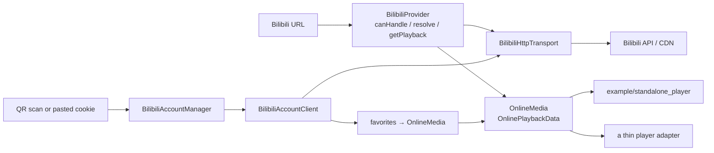

<div align="center">

# namida-bilibili-provider

**Bilibili playback and personal-data APIs as a standalone Dart package.**

[](LICENSE)
[](https://dart.dev)
[](#testing)
[](#the-demo-app)

[Playback](#play-a-public-video) · [Account](#scan-to-log-in) · [Demo app](#the-demo-app) · [Testing](#testing) · [Docs](#documentation) · [Status](#status)

</div>

---

## What is this?

This repository turns Bilibili into a first-class online source for a Dart or
Flutter player. It implements the Bilibili side end to end — URL parsing,
metadata, DASH stream extraction, and the signed-in user's own account data —
behind a small provider-neutral contract, so a player only has to map
`stream.url` + `stream.headers` into its audio and video sources.

It was written because Namida's YouTube support comes from a **private** package
(`youtipie`), which makes it impossible for anyone outside the project to build,
run, or test a Bilibili integration. So the Bilibili half is kept public,
self-contained, and verifiable on its own: the packages do not import Namida, and
they do not need Namida to work.

> **Not an official Namida component.** No integration in this repository has been
> compiled or tested against Namida. See [Namida integration](#namida-integration).

|  |  |
|---|---|
| **Playback** | metadata, uploader, cover, duration, description · multi-part / CID resolution · DASH **video and audio as separate streams** · quality id/label, resolution, FPS, bitrate · raw codec + codec family · per-stream HTTP headers · backup URLs · expiry metadata · HTTP Range validation |
| **Account** | scan-to-login (Bilibili's own QR flow) · cookie stores (in-memory, runtime "do not remember", plain-text file) · profile · account switching · sign-out · favorites: list, page, add, remove |
| **Not here** | history, subscriptions, user playlists (planned) · search, feed, comments, danmaku · live, bangumi, downloads, subtitles · **no** DRM / membership / paid / region-lock bypass |

## Repository layout

```text
packages/
  online_media_provider/     provider-neutral contract + DTOs; knows nothing about Bilibili
  bilibili_provider/         Bilibili implementation: URL/API/DASH, account layer, parsers
example/
  standalone_player/         real Flutter app: playback + login + favorites browser
```

Online tests live inside the provider package
(`packages/bilibili_provider/test/online/`) and are excluded from the default
offline run by tags.

Inside `bilibili_provider`, playback and account code meet in exactly one place:



`BilibiliHttpTransport` is the only place a `Cookie` header is attached — and the
only place that is forbidden from logging one.

## Play a public video

```dart
import 'package:bilibili_provider/bilibili_provider.dart';

final provider = BilibiliProvider();                 // anonymous by default
final media = await provider.resolve(
  Uri.parse('https://www.bilibili.com/video/BV17xeRz9EJs/'),
);
final playback = await provider.getPlayback(media.id);

final audio = playback.audioStreams.first;           // pick your own policy
final video = playback.videoStreams.first;
// Hand url + headers to your player. Both are required.
```

Supported inputs:

```text
https://www.bilibili.com/video/BV...        https://b23.tv/...   (bounded redirects)
https://www.bilibili.com/video/av...        ?p=N                (part selection)
```

The provider never fakes a single muxed URL for DASH content, and `getPlayback`
may be called again at any time to refresh expired CDN URLs.

## Scan to log in

Sign-in uses Bilibili's own web QR flow: the user scans with the Bilibili app and
confirms on their own device. There is no password, no captcha, and no browser
profile involved.

```dart
final manager = BilibiliAccountManager();            // anonymous until sign-in

final session = await manager.signInWithQrCode(
  onProgress: (status) => renderQr(status.login?.uri, status.stage),
  pollInterval: const Duration(seconds: 2),
  timeout: const Duration(minutes: 3),
  isCancelled: () => dialogClosed,
);

final account = await manager.getCurrentAccount();   // mid / name / avatar
final folders = await manager.client.getCreatedFavoriteFolders(mid: account!.mid);

// Favorites carry a BVID but no CID, so fill the part in before playback.
final favorites = await manager.getAllFavoriteMedia(mediaId: folders.first.mediaId);
final resolved  = await manager.createMediaProvider().resolveById(favorites.first.id);
```

`BilibiliQrLoginStage` reports `pending → scanned → confirmed`, plus `expired` and
`failed`; the delivered session is validated through `nav` before it is adopted,
exactly like a pasted cookie. A manual cookie paste is available as a fallback.

To keep a login on disk (desktop/server only, plain text, opt-in):

```dart
import 'package:bilibili_provider/bilibili_provider.dart';
import 'package:bilibili_provider/io.dart';

final store = ConditionalBilibiliCookieStore(
  PlainTextFileBilibiliCookieStore(),   // %APPDATA%\namida_bilibili_provider\*.json
);
final manager = BilibiliAccountManager(cookieStore: store);
await manager.restore();
store.persist = rememberMe;             // false drops every write
```

The main library contains no `dart:io`, so merely importing the provider can never
write a credential to disk.

## The demo app

`example/standalone_player` is a real Flutter app that exercises the whole stack:
URL playback, scan-to-login, saved sessions, and a favorites browser.

```powershell
cd example/standalone_player
flutter pub get
flutter run -d windows
```

- **account card** — anonymous/signed-in state, avatar, mid, validity, refresh,
  switch to anonymous, sign out, delete saved cookies;
- **login dialog** — `扫码登录` (default, renders the QR with `qr_flutter`) or
  `手动输入 Cookie` (fallback), plus a "save to this machine" switch;
- **favorites browser** — folders, paged items (`ps=20`), expired entries hidden
  with a count, and tap-to-play.

Verified by hand on Windows: playback, scan-to-login, session persistence across
restarts, and `flutter build windows --debug`. Other platform folders are not
included; generate them with `flutter create --platforms=android,ios,linux,macos,web .`

## Testing

Offline tests never touch the network — they use fixtures and an injected
`MockClient` — so they run in CI on every push.

| Suite | Count | Notes |
|---|---|---|
| `bilibili_provider` offline | **231** | 53 playback/URL/metadata/DASH + 178 account layer |
| `online_media_provider` offline | **7** | provider-neutral model behaviour |
| tagged online | 9 | real Bilibili; **4 need no credentials** |
| opt-in authenticated | 5 | your own account, skipped unless you provide cookies |

```powershell
# offline, no network needed
cd packages/bilibili_provider
dart test

# credential-free online checks (public video, anonymous nav, QR ticket)
dart test --tags online --run-skipped

# with your own account: read-only checks + manual diagnostics
$env:BILIBILI_TEST_COOKIES = 'SESSDATA=...; bili_jct=...; DedeUserID=...'
dart test --tags authenticated --run-skipped
dart run tool/bilibili_account_check.dart --folder 200000001
```

The authenticated suite also has an opt-in favorite round trip that adds a video to
a folder, verifies it appears, then removes it and verifies it is gone, leaving the
folder exactly as it was found. Enable it with `BILIBILI_TEST_WRITE_FOLDER_ID` and
`BILIBILI_TEST_WRITE_BVID`.

Signals worth knowing when an authenticated check fails:

| Symptom | Meaning |
|---|---|
| `BilibiliAuthenticationException`, code `-101` | the cookie expired; sign in again |
| `BilibiliAuthenticationException`, code `-111` | `bili_jct` is missing or stale |
| `BilibiliAccessDeniedException` or code `62002`/`62004` | that folder or media is not accessible with these cookies |
| `BilibiliApiException`, code `-352` | Bilibili risk control; wait, and never retry in a loop |

## Security model

- anonymous by default; credentials arrive only from an explicit sign-in;
- one choke point (`BilibiliHttpTransport`) attaches cookies, and it cannot log them;
- debug output is off by default; when enabled it emits only `METHOD host/path -> status` — no query strings, no bodies, no headers;
- every cookie-carrying type redacts `toString()`, and no exception message contains a cookie, csrf token, QR ticket, or stream URL (enforced by tests);
- QR tickets are single-use and never rendered as text;
- `dart:io` is confined to the opt-in `io.dart` entry point;
- no DRM, membership, paid, or region-lock bypass — only what an anonymous or signed-in user may already watch.

## Limits

- ordinary public videos, plus the signed-in user's own profile and favorites; no
  history, subscriptions, or user playlists yet;
- no search, feed, comments, danmaku, live, bangumi, downloads, or subtitles;
- sign-in is scan-to-login or a user-supplied cookie: there is no password or SMS
  flow;
- the shipped file cookie store keeps cookies as **plain text** under the per-user
  application data directory. Supply a keychain/DPAPI-backed
  `BilibiliCookieStore` if you need encryption at rest;
- CDN URLs expire, so call `getPlayback` again instead of caching a URL forever;
- verified on Windows desktop: playback, scan-to-login, session persistence across
  restarts, and `flutter build windows --debug`. The QR `confirmed` branch was
  exercised through fixtures; the live endpoint was verified up to `pending`.

## Documentation

Everything public is in one file:
**[docs/INTERFACE_REFERENCE.md](docs/INTERFACE_REFERENCE.md)** — every type and
signature, the HTTP endpoints, the guarantees, and what a player adapter has to do.

## Namida integration

Namida has no formal provider interface yet: playable dispatch in
`lib/base/audio_handler.dart` recognizes only `Selectable` and `YoutubeID`, and its
stream types come from the private `youtipie` package. A third-party provider
therefore has nothing to plug into, which is why this project ships the Bilibili
side only and makes no claim about a working adapter.

[NAMIDA_UPSTREAM_ISSUE.md](docs/NAMIDA_UPSTREAM_ISSUE.md) describes the one dispatch
gap and the smallest hook that would close it, including a verified detail: the
player can already pass per-stream headers to `AudioVideoSource.uri(...)`, but the
DASH builder in between does not forward them.

## License

[MIT](LICENSE)
