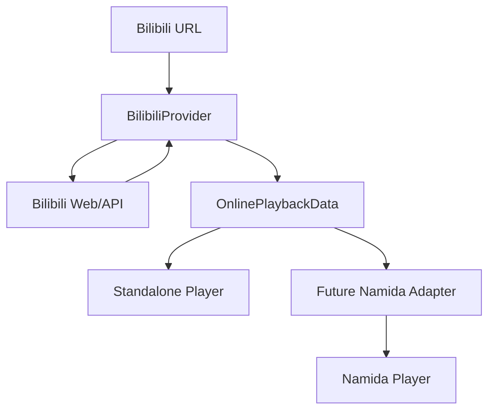
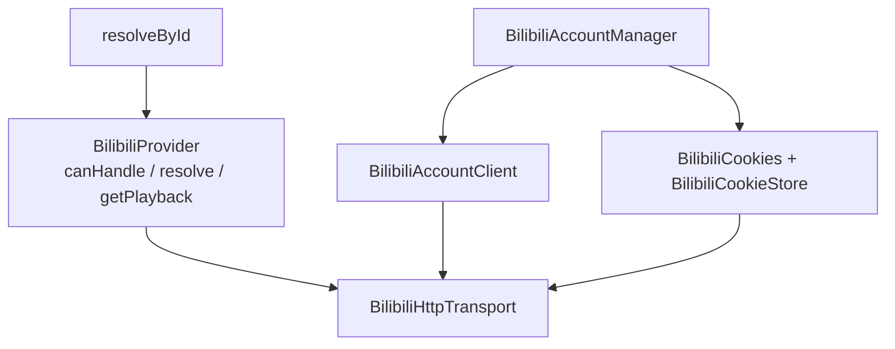

# namida-bilibili-provider

A standalone Bilibili online-media provider designed for potential integration
with [Namida](https://github.com/namidaco/namida).

**This project is not an official Namida component.** It does not depend on
Namida or on the private `youtipie` package. The goal is to make the Bilibili
side complete, testable, and playable on its own so a future Namida adapter only
has to map a small provider-neutral playback contract into Namida's player.

> Current status: Stage 0-9. The Bilibili provider, provider-neutral contract,
> standalone Flutter playback, documentation, and an untested Namida reference
> integration analysis are complete. Stage 8-9 add a Bilibili account/personal-data
> layer: explicit-cookie sign-in, cookie storage, current-account info, account
> switching, and favorites (folders, paging, add/remove). The account layer is
> integrated into the standalone app as a login dialog, a saved-cookie store and a
> favorites browser. See [docs/BILIBILI_ACCOUNT_LAYER.md](docs/BILIBILI_ACCOUNT_LAYER.md).

## Problem

Namida already has YouTube playback, but its YouTube parsing/stream extraction
is supplied by a private package (`youtipie`). This makes it impossible to
clone, extend, build, and verify a Bilibili integration locally. A feature
request alone would leave all Bilibili API, CID, DASH, header, and expiry work
to the Namida maintainer.

## Goal

Implement a complete, independently testable Bilibili provider that exposes:

- provider-neutral metadata and parts;
- separate DASH video and audio stream descriptions;
- raw codec, quality, resolution, FPS, bitrate, headers, backup URLs, and
  expiry information;
- structured errors and an optional explicit auth boundary;
- a standalone Flutter demo proving real playback without Namida/YoutiPie.

The remaining Namida-side work should be only a thin adapter from
`OnlinePlaybackData` to Namida's existing audio/video source layer.

## Architecture



The repository is split into two packages:

- `packages/online_media_provider`  provider-neutral DTOs and contracts.
- `packages/bilibili_provider`  Bilibili URL/API/DASH implementation plus the
  account/personal-data layer. The public provider API does not expose Bilibili
  API JSON models.

Inside `packages/bilibili_provider`, playback and account concerns stay separate:



`BilibiliHttpTransport` is the single place cookies are attached, which is also
where credential logging is prohibited.

## Five-line usage example

```dart
final provider = BilibiliProvider();
final media = await provider.resolve(Uri.parse('https://www.bilibili.com/video/BV...'));
final playback = await provider.getPlayback(media.id);
final audio = playback.audioStreams.first; // choose with your own policy
final video = playback.videoStreams.first;
// Pass audio.url/video.url and audio.headers/video.headers to the player.
```

## Supported URLs

MVP target:

- `https://www.bilibili.com/video/BV...`
- `https://www.bilibili.com/video/av...`
- `https://b23.tv/...`
- `?p=N` part selection

The parser and metadata stage handle all of these, including bounded redirects for b23.tv short links.

## Supported playback features (MVP target)

- metadata: title, UP name, cover, duration, description;
- multi-part/P selection and CID resolution;
- DASH separate audio/video streams;
- quality id/label, resolution, FPS parsing;
- raw codec plus coarse codec family;
- required per-stream HTTP headers;
- backup URL lists;
- URL expiry metadata and stream refresh through `getPlayback`;
- stream HTTP range validation;
- real playback in the standalone Flutter example.

## Account and personal data

Sign-in is Bilibili's own scan-to-login flow: the user scans a QR with the
Bilibili app and confirms on their own device. No password, captcha, or browser
profile is involved.

```dart
final manager = BilibiliAccountManager();

// Scan to log in. onProgress also carries the QR content to render.
final session = await manager.signInWithQrCode(
  onProgress: (status) => renderQr(status.login?.uri, status.stage),
  pollInterval: const Duration(seconds: 2),
  timeout: const Duration(minutes: 3),
  isCancelled: () => dialogClosed,
);

// Fallback for environments where scanning is impossible.
await manager.signInWithCookies(BilibiliCookies.fromUserInput(pastedHeader));

final account = await manager.getCurrentAccount();   // mid / name / avatar
final client = manager.client;
final folders = await client.getCreatedFavoriteFolders(mid: account!.mid);
final favorites = await client.getAllFavoriteMedia(mediaId: folders.first.mediaId);

// Favorites carry a BVID but no CID, so resolve the part before playback.
final provider = manager.createMediaProvider();
final resolved = await provider.resolveById(favorites.first.id);
final playback = await provider.getPlayback(resolved.id);
```

To keep a login on disk (desktop/server only), opt into the `dart:io` entry point:

```dart
import 'package:bilibili_provider/bilibili_provider.dart';
import 'package:bilibili_provider/io.dart';

final store = ConditionalBilibiliCookieStore(
  PlainTextFileBilibiliCookieStore(),   // %APPDATA%\namida_bilibili_provider\*.json
);
final manager = BilibiliAccountManager(cookieStore: store);
await manager.restore();
store.persist = rememberMe;             // "do not remember" drops all writes
```

Security properties of the layer:

- anonymous by default; credentials only from an explicit scan-to-login or the
  user's own pasted cookie, never from a browser profile;
- QR tickets are single-use and redacted in `toString()`; they are never logged;
- cookies are validated against `nav` before being adopted, so a rejected jar
  never replaces a working session;
- `toString()` on every cookie-carrying type is redacted, and exception messages
  never contain cookie or csrf values (asserted by tests);
- debug logging is off by default and, when enabled, emits only
  `METHOD host/path -> status`;
- the main library contains no `dart:io`, so importing the provider cannot write
  credentials; the opt-in file store keeps plain text and says so;
- no DRM, membership, paid, or region-lock handling.

See [docs/BILIBILI_ACCOUNT_LAYER.md](docs/BILIBILI_ACCOUNT_LAYER.md) for the full
API, endpoint list, fixtures, and the Namida/YoutiPie mapping table.

## In-app login and favorites

`example/standalone_player` now covers the account layer, not just playback:

```powershell
cd example/standalone_player
flutter run -d windows
```

- account card at the top: anonymous / signed-in state, avatar, mid, validity,
  refresh, switch-to-anonymous, sign out, delete saved cookies;
- login dialog: 扫码登录 (default, renders the QR with `qr_flutter`) or 手动输入
  Cookie (fallback), plus a switch for saving the session to
  `%APPDATA%\namida_bilibili_provider\bilibili_account_cookies.json`;
- favorites browser at the bottom: folder list, paged items (`ps=20`), expired
  entries hidden with a count, and tap-to-play through `resolveById()`.

See [example/standalone_player/README.md](example/standalone_player/README.md).

## Test status

Offline tests are required to pass without network access. The current suite
contains 206 offline tests in `bilibili_provider` (53 playback/URL/metadata/DASH
tests plus 153 account-layer tests) and 7 provider-neutral model tests in
`online_media_provider`. There are also tagged online tests that resolve a public
video and validate its streams, plus a credential-free online check that
anonymous `nav` still reports an unauthenticated session. Online tests are tagged
and run only through the scheduled/manual workflow.

Authenticated behaviour is verified separately and only when you supply your own
cookies through an environment variable; nothing runs by default and nothing is
committed:

```powershell
cd packages/bilibili_provider
$env:BILIBILI_TEST_COOKIES = 'SESSDATA=...; bili_jct=...; DedeUserID=...'
dart test --tags authenticated --run-skipped          # read-only checks
dart run tool/bilibili_account_check.dart             # manual diagnostics
```

See [docs/BILIBILI_ACCOUNT_LAYER.md](docs/BILIBILI_ACCOUNT_LAYER.md) section 6 for
the full procedure, the opt-in favorite write round trip, and the failure table.

Run locally:

```powershell
cd packages/online_media_provider
flutter pub get
dart test

cd ../bilibili_provider
flutter pub get
dart test
```

## Standalone demo

The standalone Flutter example lives under `example/standalone_player/`.
It uses `media_kit` (mpv-compatible) for video and a second `media_kit`
player for audio, keeping the provider's separate DASH model intact.

On Windows:

```powershell
cd example/standalone_player
flutter pub get
flutter run -d windows
```

The included Windows runner proves the app is a real Flutter application.

Manual verification on Windows: `flutter run -d windows` built successfully, PLAY displayed real video, and audio played without errors.
For Android/iOS/Linux/macOS/web, generate the missing platform folders once:

```text
flutter create --platforms=android,ios,linux,macos,web .
```

## Namida integration boundary

Namida currently has no formal provider interface; its playable dispatch mainly
recognizes `Selectable`/`YoutubeID`, and its stream types come from YoutiPie.
This project does **not** claim a tested Namida integration. We provide a
reference adapter and minimal integration proposal for the Namida maintainer to
evaluate after the provider itself is tested.

See [docs/NAMIDA_INTEGRATION.md](docs/NAMIDA_INTEGRATION.md).

## Known limitations

- Anonymous/public ordinary videos plus the signed-in user's own account data.
- Sign-in is explicit-cookie only: no QR, password, or SMS login flow yet.
- No encrypted cookie store implementation is shipped; only the
  `BilibiliCookieStore` boundary and an in-memory default.
- No history, subscriptions, or user playlists/collections yet (Stages 10-12).
- No paid, DRM, region-locked, or member-only bypass.
- No live, bangumi, comments, danmaku, search, or recommendations.
- Standalone playback is manually verified on Windows; other platform folders are not included/verified by default.
- The first Windows media_kit build downloads libmpv/ANGLE from GitHub release assets; restricted networks may need the offline workaround in `example/standalone_player/README.md`.

## Development stages

- [x] Stage 0  repository bootstrap, provider-neutral DTOs/contract, tests, CI
- [x] Stage 1  BV/av/b23 URL parser and part parameter
- [x] Stage 2  metadata, uploader, cover, duration, parts, CID resolution
- [x] Stage 3  DASH playback resolver
- [x] Stage 4  stream HTTP validation
- [x] Stage 5  standalone Flutter player
- [x] Stage 6  complete documentation
- [x] Stage 7  optional untested Namida reference adapter
- [x] Stage 8  account foundation: cookies, cookie store, session, current account
- [x] Stage 9  favorites: favlist URLs, folders, paging, add/remove, playback bridge
- [ ] Stage 10 history
- [ ] Stage 11 following / subscriptions
- [ ] Stage 12 user playlists / collections


