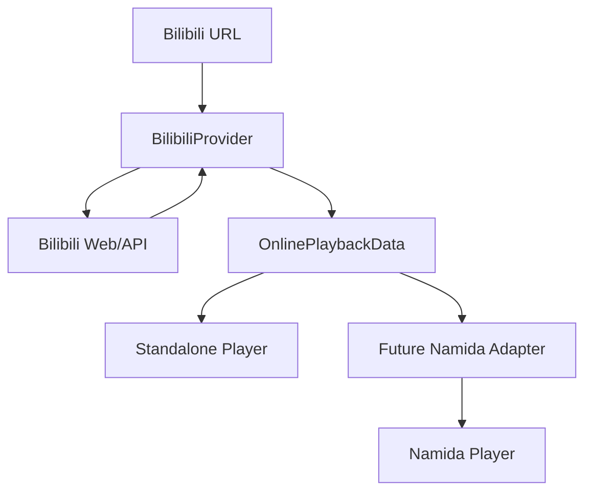

# namida-bilibili-provider

A standalone Bilibili online-media provider designed for potential integration
with [Namida](https://github.com/namidaco/namida).

**This project is not an official Namida component.** It does not depend on
Namida or on the private `youtipie` package. The goal is to make the Bilibili
side complete, testable, and playable on its own so a future Namida adapter only
has to map a small provider-neutral playback contract into Namida's player.

> Current status: Stage 0-6. The provider-neutral contract, URL/metadata/DASH
> resolution, stream range validation, and standalone Flutter playback are
> implemented. The standalone demo was manually verified on Windows with the
> public test video: metadata loaded, video and audio DASH streams played, and
> play/pause/seek worked. Documentation is finalized. Stage 7 (optional Namida
> reference patch) remains optional.

## Problem

Namida already has YouTube playback, but its YouTube parsing/stream extraction
is supplied by a private package (`youtipie`). This makes it impossible to
clone, extend, build, and verify a Bilibili integration locally. A feature
request alone would leave all Bilibili API, CID, DASH, header, and expiry work
to the Namida maintainer.

## Goal

Implement a complete, independently testable Bilibili provider that exposes:

- provider-neutral metadata and parts;
- separate DASH video and audio stream descriptions;
- raw codec, quality, resolution, FPS, bitrate, headers, backup URLs, and
  expiry information;
- structured errors and an optional explicit auth boundary;
- a standalone Flutter demo proving real playback without Namida/YoutiPie.

The remaining Namida-side work should be only a thin adapter from
`OnlinePlaybackData` to Namida's existing audio/video source layer.

## Architecture



The repository is split into two packages:

- `packages/online_media_provider`  provider-neutral DTOs and contracts.
- `packages/bilibili_provider`  Bilibili URL/API/DASH implementation. The
  public provider API does not expose Bilibili API JSON models.

## Five-line usage example

```dart
final provider = BilibiliProvider();
final media = await provider.resolve(Uri.parse('https://www.bilibili.com/video/BV...'));
final playback = await provider.getPlayback(media.id);
final audio = playback.audioStreams.first; // choose with your own policy
final video = playback.videoStreams.first;
// Pass audio.url/video.url and audio.headers/video.headers to the player.
```

## Supported URLs

MVP target:

- `https://www.bilibili.com/video/BV...`
- `https://www.bilibili.com/video/av...`
- `https://b23.tv/...`
- `?p=N` part selection

The parser and metadata stage handle all of these, including bounded redirects for b23.tv short links.

## Supported playback features (MVP target)

- metadata: title, UP name, cover, duration, description;
- multi-part/P selection and CID resolution;
- DASH separate audio/video streams;
- quality id/label, resolution, FPS parsing;
- raw codec plus coarse codec family;
- required per-stream HTTP headers;
- backup URL lists;
- URL expiry metadata and stream refresh through `getPlayback`;
- stream HTTP range validation;
- real playback in the standalone Flutter example.

## Test status

Offline tests are required to pass without network access. The current suite
contains 60 offline tests: 7 provider-neutral model tests and 53 Bilibili
URL/client/metadata/DASH tests. There is also 1 tagged online test that
resolves a public video, fetches DASH streams, and validates the first
video/audio stream with an HTTP Range request. Online tests are tagged and
run only through the scheduled/manual workflow.

Run locally:

```powershell
cd packages/online_media_provider
flutter pub get
dart test

cd ../bilibili_provider
flutter pub get
dart test
```

## Standalone demo

The standalone Flutter example lives under `example/standalone_player/`.
It uses `media_kit` (mpv-compatible) for video and a second `media_kit`
player for audio, keeping the provider's separate DASH model intact.

On Windows:

```powershell
cd example/standalone_player
flutter pub get
flutter run -d windows
```

The included Windows runner proves the app is a real Flutter application.

Manual verification on Windows: `flutter run -d windows` built successfully, PLAY displayed real video, and audio played without errors.
For Android/iOS/Linux/macOS/web, generate the missing platform folders once:

```text
flutter create --platforms=android,ios,linux,macos,web .
```

## Namida integration boundary

Namida currently has no formal provider interface; its playable dispatch mainly
recognizes `Selectable`/`YoutubeID`, and its stream types come from YoutiPie.
This project does **not** claim a tested Namida integration. We provide a
reference adapter and minimal integration proposal for the Namida maintainer to
evaluate after the provider itself is tested.

See [docs/NAMIDA_INTEGRATION.md](docs/NAMIDA_INTEGRATION.md).

## Known limitations

- Anonymous/public ordinary videos only in the MVP.
- No login/QR/cookie extraction.
- No paid, DRM, region-locked, or member-only bypass.
- No live, bangumi, comments, danmaku, search, or recommendations in the MVP.
- Standalone playback is manually verified on Windows; other platform folders are not included/verified by default.
- The first Windows media_kit build downloads libmpv/ANGLE from GitHub release assets; restricted networks may need the offline workaround in `example/standalone_player/README.md`.

## Development stages

- [x] Stage 0  repository bootstrap, provider-neutral DTOs/contract, tests, CI
- [x] Stage 1  BV/av/b23 URL parser and part parameter
- [x] Stage 2  metadata, uploader, cover, duration, parts, CID resolution
- [x] Stage 3  DASH playback resolver
- [x] Stage 4  stream HTTP validation
- [x] Stage 5  standalone Flutter player
- [x] Stage 6  complete documentation
- [ ] Stage 7  optional untested Namida reference adapter


